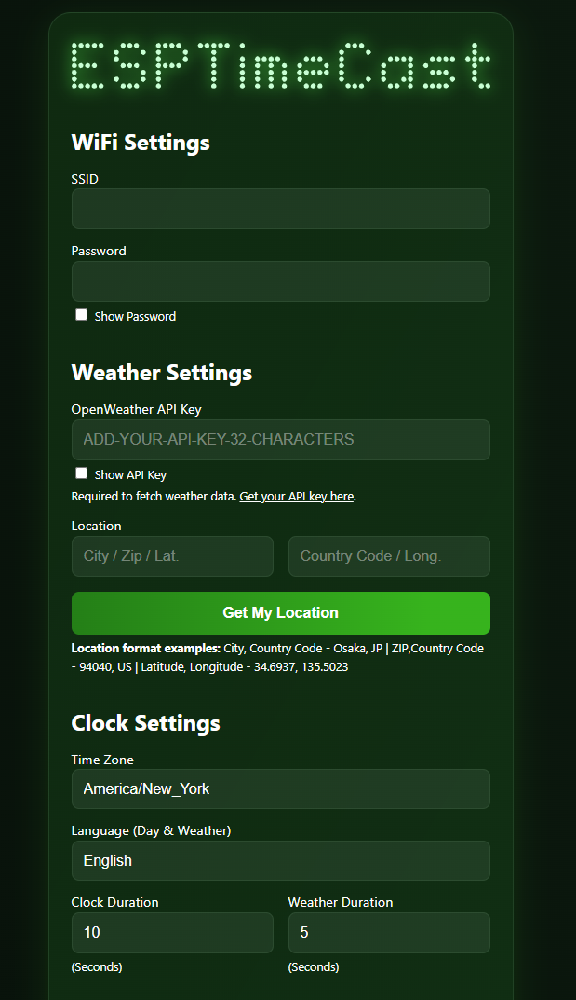
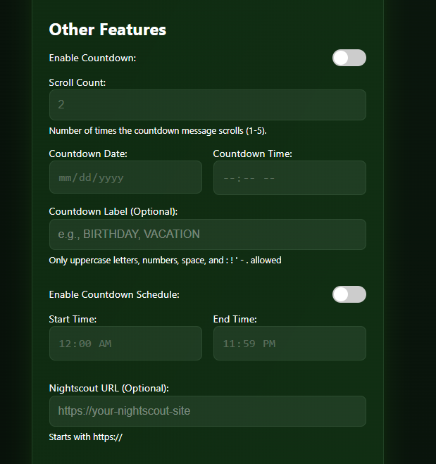
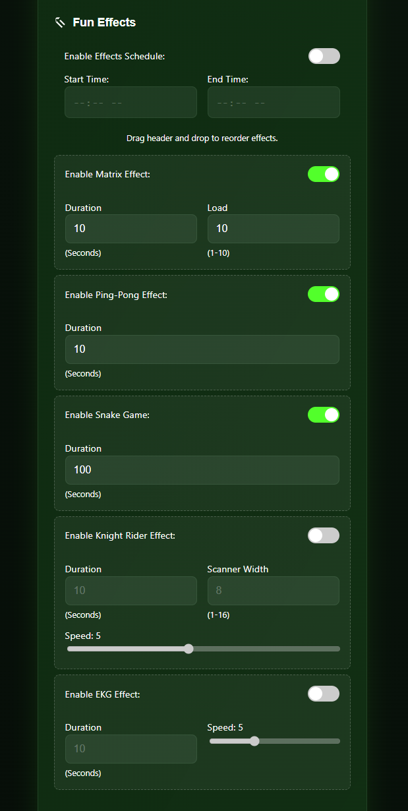
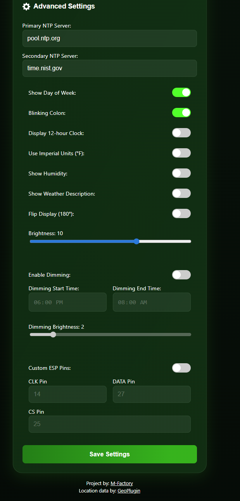

**ESPTimeCast Advanced** is a WiFi-connected LED matrix display based on ESP32 and Max7219. It is forked from  [mfactory-osaka](https://github.com/mfactory-osaka/ESPTimeCast) and upgraded with a few advanced features.  
It displays the current time, day of the week, and local weather (temp/humidity/weather description) fetched from OpenWeatherMap, countdown timer, and effects display. Optionally you can also enable glucose + trend display (Nightscout-compatible). 
Setup and configuration are fully managed via a built-in web interface.  

Fundamental changes from the original creator:
1. Added 'Scheduler' to the countdown 
2. Changed the format of the countdown message to be easier to see
3. Added a configurable number of times the countdown message scrolls across.
4. Added 5 fun effects to the rotation with high degree of customizability. They too have a scheduler capability.
5. Added Custom ESP Pins to the web UI. Define your ESP pins right in the UI

The reason for the scheduler is that in the early mornings, evenings and at night, I mostly just want the time and weather.

 

## 📦 3D Printable Case

If you want a case for your creation you can purchase the 3D print case files from the original creator!

---

## ✨ Features

- **LED Matrix Display (8x32)** powered by MAX7219, with custom font support
- **Simple Web Interface** for all configuration (WiFi, weather, time zone, display durations, and more)
- **Automatic NTP Sync** with robust status feedback and retries
- **Weather Fetching** from OpenWeatherMap (every 5 minutes, temp/humidity/description)
- **Fallback AP Mode** for easy first-time setup or configuration
- **Timezone Selection** from IANA names (DST integrated on backend)
- **Get My Location** button to get your approximate Lat/Long.
- **Week Day and Weather Description display** in multiple languages
- **Persistent Config** stored in LittleFS, with backup/restore system
- **Status Animations** for WiFi connection, AP mode, time syncing.
- **Dramatic Countdown** function
  - **NEW** Scroll count
  - **NEW** Countdown Schedule - will turn on the countdown during this set schedule. If this is turned off it will show all the time.
- Optional **glucose + trend** display (Nightscout-compatible)
- **ALL NEW Fun Effects** 
  - **Effects schedule** will turn on the effects during this set schedule. If this is turned off it will show all the time.
  - Effect order can be changed by dragging and dropping
  - Effects:
	  - EKG (heat beat)
	    - Settings: Duration and Speed
	  - Matrix Effect
	    - Settings: Duration and Matrix Load (increase/decrease the rain)
	  - Ping Pong Effect
	    - Settings: Duration
	  - Snake
	    - Settings: Duration
	  - Knight Rider
	    - Settings: Duration, Scanner width, Scanner Speed

- **Advanced Settings** panel with:
  - Custom **Primary/Secondary NTP server** input
  - Display **Day of the Week** toggle (default is on)
  - Display **Blinking Colon** toggle (default is on)
  - **24/12h clock mode** toggle (24-hour default)
  - **Imperial Units (°F)** toggle (metric °C defaults)
  - Show **Humidity** toggle (display Humidity besides Temperature)
  - **Weather description** toggle (displays: heavy rain, scattered clouds, thunderstorm etc.)
  - **Flip display** (180 degrees)
  - Adjustable display **brightness**
  - Dimming Hours **Scheduling**
  - **NEW Custom ESP Pins** Define your pins right in the UI
  
    
---

## 🪛 Wiring

**Wemos S2 Mini (ESP32) → MAX7219**

| Wemos S2 Mini | MAX7219 |
| :-----------: | :-----: |
|      GND      |   GND   |
|       9       |   CLK   |
|      11       |   CS    |
|      12       |   DIN   |
|      5V       |   VCC   |

---

## 🌐 Web UI & Configuration

The built-in web interface provides full configuration for:

- **WiFi settings** (SSID & Password)
- **Weather settings** (OpenWeatherMap API key, City, Country, Coordinates)
- **Time zone** (will auto-populate if TZ is found)
- **Day of the Week and Weather Description** languages
- **Display durations** for clock and weather (milliseconds)
- **Dramatic Countdown** function
  - **NEW** Scroll count
  - **NEW** Countdown Schedule - will turn on the countdown during this set schedule. If this is turned off it will show all the time.
- Optional **glucose + trend** display (Nightscout-compatible)
- **ALL NEW Fun Effects**  (see below)
- **Advanced Settings** (see below)

### First-time Setup / AP Mode

6. Power on the device. If WiFi fails, it auto-starts in AP mode:
   - **SSID:** `ESPTimeCast`
   - **Password:** `12345678`
   - Open `http://192.168.4.1` or `http://setup.esp` in your browser.
7. Set your WiFi and all other options.
8. Click **Save Setting** – the device saves config, reboots, and connects.
9. The device shows its local IP address after boot so you can login again for setting changes

*External links and the "Get My Location" button require internet access.  
They won't work while the device is in AP Mode - connect to Wi-Fi first.

### UI Example:
  

---
## Fun Effects

Click the **Fun Effects** in the web UI to reveal configuration options.  
***DRAG AND DROP*** effects to change the order of which shows first

  - **Effects schedule** will turn on the effects during this set schedule. If this is turned off it will show all the time.
  - EKG (heat beat)
	  - Settings: Duration and Speed
  - Matrix Effect
	  - Settings: Duration and Matrix Load (increase/decrease the rain)
  - Ping Pong Effect
	  - Settings: Duration
  - Snake
	  - Settings: Duration
  - Knight Rider
	  - Settings: Duration, Scanner width, Scanner Speed
## ⚙️ Advanced Settings

Click the **cog icon** next to “Advanced Settings” in the web UI to reveal extra configuration options.  

**Available advanced settings:**

- **Primary NTP Server**: Override the default NTP server (e.g. `pool.ntp.org`)
- **Secondary NTP Server**: Fallback NTP server (e.g. `time.nist.gov`)
- **Day of the Week**: Display Day of the Week in the desired language
- **Blinking Colon** toggle (default is on)
- **24/12h Clock**: Switch between 24-hour and 12-hour time formats (24-hour default)
- **Imperial Units (°F)** toggle (metric °C defaults)
- **Humidity**: Display Humidity besides Temperature
- **Weather description** toggle (display weather description in the selected language* for 3 seconds or scrolls once if description is too long)
- **Flip Display**: Invert the display vertically/horizontally
- **Brightness**: 0 (dim) to 15 (bright)
- **Dimming Feature**: Start time, end time and desired brightness selection
- **NEW Custom ESP Pins** Define your pins right in the UI

*Non-English characters converted to their closest English alphabet.  
Tip: Don't forget to press the save button to keep your settings

---

## 📝 Configuration Notes

- **OpenWeatherMap API Key:**
   - [Make an account here](https://home.openweathermap.org/users/sign_up)
   - [Check your API key here](https://home.openweathermap.org/api_keys)
- **City Name:** e.g. `Tokyo`, `London`, etc.
- **Country Code:** 2-letter code (e.g., `JP`, `GB`)
- **ZIP Code:** Enter your ZIP code in the city field and US in the country field (US only)
- **Latitude and Longitude** You can enter coordinates in the city field (lat.) and country field (long.)
- **Time Zone:** Select from IANA zones (e.g., `America/New_York`, handles DST automatically)

---

## 🚀 Getting Started

This guide will walk you through setting up your environment and uploading the **ESPTimeCast** project to your **ESP8266** or **ESP32** board. Please follow the instructions carefully for your specific board type.

---

### ⚙️ ESP32 Setup

Follow these steps to prepare your Arduino IDE for ESP32 development:

10.  **Install ESP32 Board Package:**
    * Go to `Tools > Board > Boards Manager...`. Search for `esp32` by `Espressif Systems` and click "Install".
11.  **Select Your Board:**
    * Go to `Tools > Board` and select your specific board, e.g., **LOLIN S2 Mini** (or your ESP32 variant).
12.  **Configure Partition Scheme:**
    * Under `Tools`, select `Partition Scheme "Default 4MB with spiffs"`. This ensures enough space for the sketch and LittleFS data.
13.  **Install Libraries:**
    * Go to `Sketch > Include Library > Manage Libraries...` and install the following:
        * `ArduinoJson` by Benoit Blanchon
        * `MD_Parola` by majicDesigns (this will typically also install its dependency: `MD_MAX72xx`)
        * `AsyncTCP` by ESP32Async
        * `ESPAsyncWebServer` by ESP32Async

---

### ⬆️ Uploading the Code and Data

Once your Arduino IDE is set up for your board (as described above):

14.  **Open the Project Folder:**
    * For ESP32: Navigate to and open the `ESPTimceCast_ESP32` project folder. Inside, you'll find the main sketch file, typically named `ESPTimceCast_ESP32.ino`. Open this `.ino` file in the Arduino IDE.
15. **Upload the Sketch:**
    * With the main sketch file open, click the "Upload" button (the right arrow icon) in the Arduino IDE toolbar. This will compile the entire project and upload it to your board.
16.  **Upload `/data` folder (LittleFS):**
    * This project uses LittleFS for storing web interface files and other assets. You'll need the LittleFS Uploader plugin.
    * [**Install the LittleFS Uploader Plugin**](https://randomnerdtutorials.com/arduino-ide-2-install-esp8266-littlefs/) 
    * **Before uploading, ensure the Serial Monitor is closed.**
    * Open the Command Palette (`Ctrl+Shift+P` on Windows, `Cmd+Shift+P` on macOS).
    * Search for and run: `Upload Little FS to Pico/ESP8266/ESP32` (the exact command name might vary).
    * **Important for ESP32:** If the upload fails, you might need to manually put your ESP32 into "Download Mode." While holding down the **Boot button** (often labeled 'BOOT' or 'IO0' or 'IO9'), briefly press and release the **RST button**, then release the Boot button.

---

## 📺 Display Behavior

**ESPTimeCast** automatically switches between two display modes: Clock and Weather.
If "Show Weather Description" is enabled a third mode (Description) will display with a duration of 3 seconds, if the description is too long to fit on the display the description will scroll from right to left once.

What you see on the LED matrix depends on whether the device has successfully fetched the current time (via NTP) and weather (via OpenWeatherMap).  
The following table summarizes what will appear on the display in each scenario:

| Display Mode | 🕒 NTP Time | 🌦️ Weather Data | 📺 Display Output                      |
| :----------: | :---------: | :--------------: | :------------------------------------- |
|  **Clock**   |    ✅ Yes    |        —         | 🗓️ Day Icon + ⏰ Time (e.g. `@ 14:53`) |
|  **Clock**   |    ❌ No     |        —         | `! NTP` (NTP sync failed)              |
| **Weather**  |      —      |      ✅ Yes       | 🌡️ Temperature (e.g. `23ºC`)          |
| **Weather**  |    ✅ Yes    |       ❌ No       | 🗓️ Day Icon + ⏰ Time (e.g. `@ 14:53`) |
| **Weather**  |    ❌ No     |       ❌ No       | `! TEMP` (no weather or time data)     |
**Legend:**
- 🗓️ **Day Icon**: Custom symbol for day of week (`@`, `=`, etc.)
- ⏰ **Time**: Current time (HH:MM)
- 🌡️ **Temperature**: Weather from OpenWeatherMap
- ✅ **Yes**: Data available
- ❌ **No**: Data not available
- — : Value does not affect this mode
### **How it works:**

- The display automatically alternates between **Clock** and **Weather** modes (the duration for each is configurable).
- If "Show Weather Description" is enabled a third mode **Description** will display after the **Weather** display with a duration of 3 seconds.
- In **Clock** mode, if NTP time is available, you’ll see the current time plus a unique day-of-week icon. If NTP is not available, you'll see `! NTP`.
- In **Weather** mode, if weather is available, you’ll see the temperature (like `23ºC`). If weather is not available but time is, it falls back to showing the clock. If neither is available, you’ll see `! TEMP`.
- All status/error messages (`! NTP`, `! TEMP`) are big icons shown on the display.

#### Countdown, Glucose and Effects ####

- If Countdown is turned on (and within scheduled times if on), it always shows AFTER weather if configured, or after the time if weather not configured
- If Glucose is configured  it will show AFTER the countdown in the rotation
- If Effects are configured they will show after the Glucose display
	- Effects have their own custom order. Drag and drop the effects to change the order

# Display order #
### Time -> Weather -> Countdown -> Glucose -> Effects ###

---

## ☕ Support this project

If you enjoy this project, please consider supporting my work:

